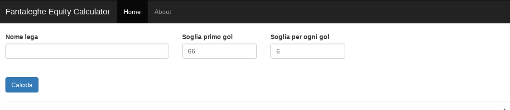
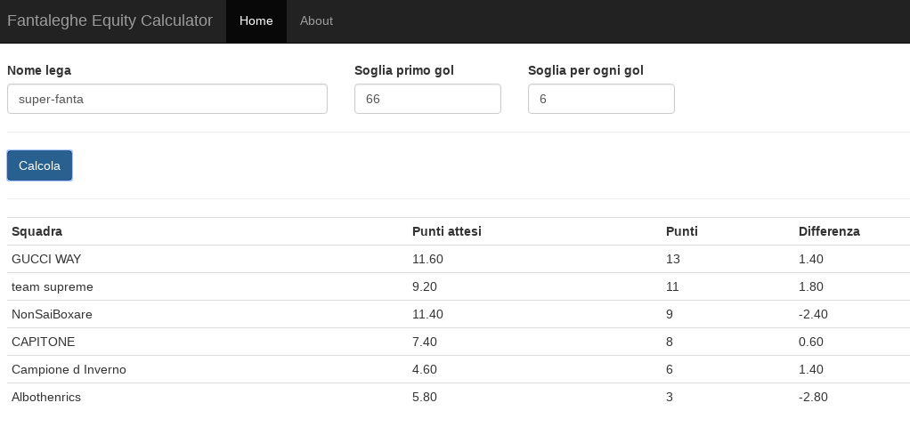

# Fantaleghe EV

This project is a web application that permits to recalculate a fantasy league rank in a *fair* way.
This application backend runs on <a href="spring.io">Spring Framework</a> and uses Java library <a href="https://jsoup.org">jsoup</a> to perform HTML parsing, while frontend is realized using <a href="https://angularjs.org/">AngularJs</a>.

This application analyzes football fantasy league hosted on <a href="http://leghe.fantagazzetta.it">leghe.fantagazzetta.it</a>. I have no relationship with them.  

### Fantasy football rules
This game is based on Italian Serie A football championship.

A league is formed by teams which roaster is composed by Serie A clubs' players.
A league day is associated to a Serie A championship day. For each league day a team picks up eleven player for the starter team and a variable number of players to compose the bench.
After the game championship is ended is possible to calculate league results.
Teams results are based on grades (1 to 10) given to players by different Italian sports newspapers (source is configurable). Also malus/bonus are applied to a player's grade if a certain event happens (a red card is usually a -1, a goal scored is usually a +3. This values are configurable by a league admin and can change).
If the sum of grades of the eleven starters (replaced by substitutes if they didn't played/get a grade) reaches a *first goal threshold* then a goal is scored by the team, two goals are scored if the sum exceeds *first goal threshold + goal threshold* and so on.
Usually first goal threshold is set to *66* (we have an average of 6 among players, 6 is a sufficient grade in a 1-10 scale)

In a *Championship* type league a team plays with all others team in the league: since team goals scored are independent from adversary team goals scored in a head to head match, luck in the drawing phase may have have a great impact on the league ranking.

This is way I come up with an algorithm which can give an estimate on how lucky, or unlucky, teams in the league are.
### Algorithm

Algorithms calculate all possible outcomes for each league day and then it returns an average values.

An example would be:
   
    TeamA 3 - TeamB 3
    TeamC 1 - TeamD 0
   
After this league game, ranking is:

    TeamC      3 
    TeamA      1    
    TeamB      1 
    TeamD      0 

Using the algorithm, we will have a new ranking:
    
    TeamA and TeamB: 1 + 3 + 3 = 7/3 = 2.33
    TeamC: 3 + 0 + 0 = 3/3 = 1
    TeamD: 0 + 0 + 0 = 0/3 = 0
    
### Sites screenshots

The site just requires three parameters:
* league name 
* first goal threshold
* goal threshold

Then click on the calculate button

After calculation is made, rank will appear on bottom. It contains:
* points calculated by the algoritm 
* actual point earned by the team
* difference between them

A *positive* difference gives an estimate on how the team has been *lucky* until now. Otherwise, a *negative* difference gives an estimate on how the team has been *unlucky*.

### License

This work is distributed under MIT license.
